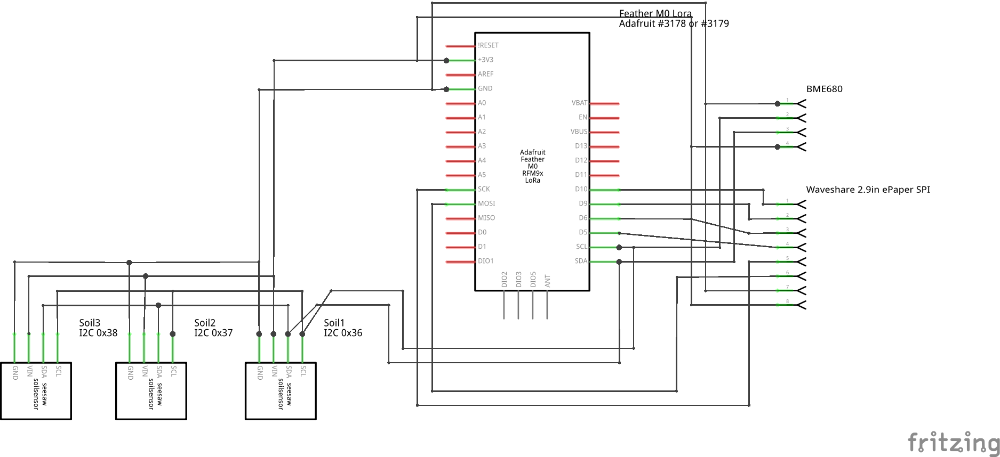

# Lora Office
This is a LoRaWAN enabled project. Its purpose is to monitor the air and the three plants in my office. It has a local ePaper display for local information.

## Parts:
* [Adafruit Feather M0 RFM9x Lora (v1)](https://learn.adafruit.com/adafruit-feather-m0-radio-with-lora-radio-module)
* [Waveshare ePaper 2.9in SPI black/white](https://www.waveshare.com/wiki/2.9inch_e-Paper_Module)
* [Pimoroni BME680](https://shop.pimoroni.com/products/bme680-breakout)
* [3 x Adafruit Stemma Soil Sensor](https://learn.adafruit.com/adafruit-stemma-soil-sensor-i2c-capacitive-moisture-sensor)

## Wiring

